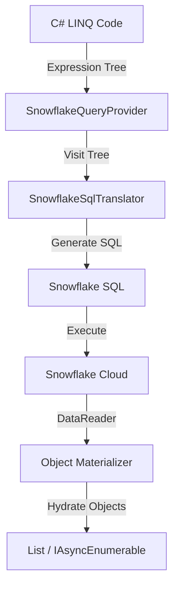

# LINQ-to-Snowflake Provider

A **C# LINQ-to-SQL translator** that enables .NET developers to write idiomatic C# code that executes natively on Snowflake Data Cloud.

## Table of Contents

1. [Overview](#overview)
2. [Architecture](#architecture)
3. [Key Features](#key-features)
4. [Usage Guide](#usage-guide)
5. [Advanced Features](#advanced-features)
   - [Window Functions](#window-functions-analytics)
   - [Set Operations](#set-operations)
   - [Semi-Structured Data (VARIANT)](#semi-structured-data-variant)
6. [Best Practices](#best-practices)

---

## Overview

The LINQ-to-Snowflake provider bridges the gap between .NET applications and Snowflake's calculation engine. It allows developers to express complex analytical queries using standard C# LINQ syntax, which are then translated into optimized Snowflake SQL at runtime.

### Why use this?
*   ✅ **Type Safety**: Compile-time checking of your queries using C# strong typing.
*   ✅ **No Context Switching**: Write C# instead of embedding raw SQL strings.
*   ✅ **Unified API**: Same LINQ patterns as `SparkQuery` and `IEnumerable`.
*   ✅ **Server-Side Execution**: Filters, joins, and aggregations run on Snowflake, not your client.

---

## Architecture

The provider follows the standard `IQueryable` pattern:



1.  **Expression Capture**: C# captures your lambda expressions (`o => o.Amount > 100`) into an Expression Tree.
2.  **Translation**: The `SnowflakeSqlTranslator` visits this tree and generates equivalent SQL fragments (`amount > 100`).
3.  **Execution**: The final SQL is sent to Snowflake via `SnowflakeDbConnection`.
4.  **Materialization**: Results act like a forward-only stream (`IAsyncEnumerable`), reading rows and mapping them back to C# objects.

---

## Key Features

| Feature | Description | SQL Equivalent |
|---------|-------------|----------------|
| **Filtering** | `Where(x => x.Id > 1)` | `WHERE id > 1` |
| **Projections** | `Select(x => new { x.Name })` | `SELECT name` |
| **Ordering** | `OrderBy(x => x.Date)` | `ORDER BY date` |
| **Pagination** | `Take(10).Skip(5)` | `LIMIT 10 OFFSET 5` |
| **Grouping** | `GroupBy(x => x.Dept)` | `GROUP BY dept` |
| **Joins** | `Join(other, ...)` | `INNER JOIN` |
| **Aggregations** | `Sum`, `Count`, `Max`, `Min` | `SUM()`, `COUNT()`... |
| **DateTime Props** | `x.Date.Year`, `x.Date.Month` | `YEAR(date)`, `MONTH(date)` |
| **Math Functions** | `Math.Abs(x)`, `Math.Round(x)` | `ABS(x)`, `ROUND(x)` |
| **String Props** | `x.Name.Length`, `x.Name.IndexOf(s)` | `LENGTH(name)`, `POSITION(s, name)` |
| **Single Element** | `Single()`, `SingleOrDefault()` | `LIMIT 2` (verify count) |

---

## Usage Guide

### 1. Basic Querying

```csharp
// 1. Initialize from a table
var orders = Snowflake.Table<Order>(options, "orders");

// 2. Build Query
var query = orders
    .Where(o => o.Status == "Active")
    .Where(o => o.Amount > 1000)
    .OrderByDescending(o => o.Date)
    .Select(o => new { o.Id, o.CustomerName, o.Amount });

// 3. Debug (Optional): See generated SQL
query.Explain(); 
// Output: SELECT id, customer_name, amount FROM orders WHERE status = 'Active'...

// 4. Execute
var results = await query.ToList();
```

### 2. Grouping and Aggregation

Use fluent syntax for aggregations:

```csharp
var stats = orders
    .GroupBy(o => o.Category)
    .Select(g => new 
    {
        Category = g.Key,
        Count = g.Count(),
        TotalSales = g.Sum(o => o.Amount),
        MaxSale = g.Max(o => o.Amount)
    });
```

---

## Advanced Features

### Window Functions (Analytics)

Perform advanced analytics (Ranking, Running Totals) without standard SQL complexity.

```csharp
// Rank orders by Amount within each Department
var ranked = orders.WithWindow(
    // 1. Define Window: PARTITION BY Dept, ORDER BY Amount DESC
    spec => spec.PartitionBy(o => o.Department).OrderByDescending(o => o.Amount),
    
    // 2. Define Projection
    (o, w) => new 
    {
        o.Id,
        o.Department,
        o.Amount,
        Rank = w.Rank(),             // RANK()
        RunningTotal = w.Sum(o.Amount) // SUM(amount) OVER (...)
    }
);
```

**Supported Functions:**
*   `Rank()`, `DenseRank()`, `RowNumber()`, `PercentRank()`, `Ntile(n)`
*   `Lag(col, n)`, `Lead(col, n)`
*   `Sum()`, `Avg()`, `Min()`, `Max()` (Over Window)

### Set Operations

Combine multiple queries efficiently.

```csharp
var q1 = orders.Where(o => o.Year == 2023);
var q2 = orders.Where(o => o.Year == 2024);

var combined = q1.Union(q2);         // UNION ALL
var distinct = q1.UnionDistinct(q2); // UNION
var overlap  = q1.Intersect(q2);     // INTERSECT
var diff     = q1.Except(q2);        // EXCEPT
```

### Semi-Structured Data (VARIANT)

Snowflake's native `VARIANT` type allows storing JSON/semi-structured data. We support the native colon syntax (`:`) for performance.

**1. Define Model using `[Variant]`**
```csharp
public class Order
{
    public int Id { get; set; }
    
    [Variant] // Marks this property as a VARIANT root
    public OrderData Data { get; set; }
    
    [Variant]
    public List<LineItem> Items { get; set; }
}

public class OrderData 
{ 
    public CustomerInfo Customer { get; set; } 
}

public class LineItem
{
    public decimal Price { get; set; }
    public int Quantity { get; set; }
}
```

**2. Query Nested Properties**
```csharp
orders.Where(o => o.Data.Customer.City == "Paris")
// Generates: WHERE data:customer:city = 'Paris'
```

**3. Filter VARIANT Arrays with `Any()`**
```csharp
orders.Where(o => o.Items.Any(i => i.Price > 100))
// Generates: WHERE ARRAY_SIZE(FILTER(items, i -> i:price > 100)) > 0
```

**Supported in `Any()` Lambda:**
- ✅ Property comparisons: `i.Price > 100`, `i.Status == "OK"`
- ✅ Logical operators: `&&`, `||`, `!`
- ✅ Arithmetic: `+`, `-`, `*`, `/`
- ❌ Method calls: `i.Name.Contains("test")` (not supported in lambda)

---

## Best Practices

1.  **String Comparisons**: C# is case-sensitive, SQL depends on collation. Use `.ToUpper()` or `.ToLower()` for consistent case-insensitive comparisons.
    ```csharp
    .Where(x => x.Name.ToUpper() == "JOHN")
    ```

2.  **Parameterization**: All query values are automatically parameterized using `SnowflakeDbParameter`. This prevents SQL injection attacks — you can safely use user input in LINQ expressions.

3.  **Streaming**: For large datasets, prefer `GetAsyncEnumerator()` (streaming) over `ToList()` (buffering).
    ```csharp
    await foreach (var item in query) { ... } // Memory efficient
    ```

4.  **Debugging**: Use `.Spy()` or `.Show()` to inspect intermediate results during development.
    ```csharp
    query.Where(...).Spy("AfterFilter").OrderBy(...)
    ```

---

## Comparison with SparkQuery

| Feature | SnowflakeQuery | SparkQuery |
|---------|---------------|------------|
| **Execution Engine** | Snowflake SQL | Apache Spark (JVM) |
| **Window Functions** | ✅ Supported | ✅ Supported |
| **Set Operations** | ✅ Supported | ✅ Supported |
| **Nested Data** | ✅ `VARIANT` (`:`) | ✅ Struct (`.`) |
| **Caching** | ⚡ Automatic | ✅ Manual (`.Cache()`) |
| **Distribution** | ⚡ Automatic | ✅ Manual (`.Repartition()`) |

Both providers share ~95% API surface area, allowing you to reuse your LINQ skills across both Big Data platforms.

---

## See Also

- [LINQ-to-Snowflake Capabilities & Limitations](LINQ-to-Snowflake-Capabilities.md) — Detailed feature support matrix
- [LINQ-to-Spark](LINQ-to-Spark.md) — SparkQuery provider documentation
- [Cases Pattern](Cases-Pattern.md) — Cases/SelectCase pattern
