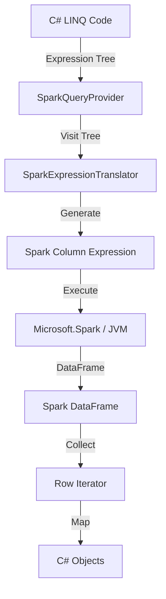

# LINQ-to-Spark Layer

A **C# LINQ-to-Spark translator** that enables .NET developers to write idiomatic C# code that executes on Apache Spark clusters.


## Table of Contents

1. [Overview](#overview)
2. [Architecture](#architecture)
3. [Key Features](#key-features)
4. [Usage Guide](#usage-guide)
   - [Connecting](#connecting-with-the-context-api)
   - [Reading Data](#reading-data)
   - [Grouping and Aggregation](#grouping-and-aggregation)
   - [Joins](#joins)
5. [Advanced Features](#advanced-features)
   - [Window Functions](#window-functions-analytics)
   - [Higher-Order Functions](#higher-order-array-functions-nested-data)
   - [Cases Pattern](#cases-pattern-conditional-routing)
   - [ForEach (Distributed)](#foreach-distributed-execution-with-field-sync)
   - [Auto-UDF Registration](#auto-udf-registration-custom-functions)
   - [Set Operations](#set-operations)
   - [Math & String](#math--string-functions)
   - [Caching & Partitioning](#caching--partitioning)
6. [Write Operations](#write-operations)
7. [Best Practices](#best-practices)
8. [Comparison with SnowflakeQuery](#comparison-with-snowflakequery)
9. [See Also](#see-also)

---

## Overview

It implements a **full expression tree translation layer** that:

1. ✅ **Translates C# LINQ expressions** → **Spark DataFrame operations**
2. ✅ **Guarantees Type-safe LINQ methods** executed by Distributed Spark power
3. ✅ **Provides a fluent, type-safe API** that feels C# native
4. ✅ **Executes on real Apache Spark** (distributed processing, fault tolerance, petabyte scale)
5. ✅ **Bridges the .NET/JVM gap** using Microsoft.Spark

---

## Architecture

The provider follows the standard `IQueryable` pattern, translated to Spark DataFrame operations:

### The Translation Pipeline



### Key Components

1.  **Expression Tree Translator**: Parses C# LINQ expressions at runtime and converts them to Spark Column operations (`o.Amount > 100` → `col("amount") > 100`).
2.  **Column Mapper**: Bridges C# naming conventions (PascalCase) ↔ Spark conventions (snake_case) and handles nested object mapping.
3.  **DataFrame Execution**: Manages the underlying `Microsoft.Spark` DataFrame state.

---

## Key Features

| Feature | Description | Spark Equivalent |
|---------|-------------|------------------|
| **Filtering** | `Where(x => x.Id > 1)` | `.Filter(col("id") > 1)` |
| **Projections** | `Select(x => new { x.Name })` | `.Select(col("name"))` |
| **Ordering** | `OrderBy(x => x.Date)` | `.Sort(col("date"))` |
| **Grouping** | `GroupBy(x => x.Dept)` | `.GroupBy("dept")` |
| **Joins** | `Join(other, ...)` | `.Join(other, ...)` |
| **Aggregations** | `Sum`, `Count`, `Max`, `Min` | `Functions.Sum()`, `Count()`... |
| **Window Functions** | `WithWindow(spec, ...)` | `Window.PartitionBy(...)` |
| **Nested Data** | `x.Address.City` | `col("address.city")` |
| **Higher-Order** | `x.Items.Any(i => i.Val > 10)` | `expr("exists(items, i -> i.val > 10)")` |
| **Auto-UDF** | `MyClass.MyMethod(x.Field)` | Auto-registered `CallUDF()` |

---

## Usage Guide

### Connecting with the Context API

The unified context API (`Spark.Connect`) represents the entry point for all Spark operations.

```csharp
// Direct connection strings
using var context = Spark.Connect("local[*]", "MyApp");                    // Local (all cores)
using var context = Spark.Connect("local[4]", "MyApp");                    // Local (4 cores)
using var context = Spark.Connect("spark://spark-master:7077", "MyApp");   // Standalone cluster
using var context = Spark.Connect("yarn", "MyApp");                        // YARN cluster
using var context = Spark.Connect("k8s://https://k8s-api:443", "MyApp");   // Kubernetes

// Using SparkMaster helpers (equivalent, type-safe)
using var context = Spark.Connect(SparkMaster.Local(), "MyApp");
using var context = Spark.Connect(SparkMaster.Local(4), "MyApp");
using var context = Spark.Connect(SparkMaster.Standalone("spark-master"), "MyApp");
using var context = Spark.Connect(SparkMaster.Yarn(), "MyApp");
using var context = Spark.Connect(SparkMaster.Kubernetes("https://k8s-api:443"), "MyApp");
```

**Advanced Configuration:**

```csharp
using var context = Spark.Connect(SparkMaster.Yarn(), "MyApp", o => {
    o.Config["spark.executor.memory"] = "4g";
    o.Config["spark.executor.cores"] = "2";
    o.Config["spark.sql.shuffle.partitions"] = "200";
    o.Hive = true;  // Enable Hive support
});
```

### Reading Data

```csharp
// From tables
var orders = context.Read.Table<Order>("orders");

// From files
var logs = context.Read.Parquet<LogEntry>("/data/logs");
var csv = context.Read.Csv<Record>("/data/file.csv");
var json = context.Read.Json<Event>("/data/events.json");

// Apply LINQ operations
var highValue = orders.Where(o => o.Amount > 1000);
```

### Pushing In-Memory Data

Push local data to Spark for distributed processing. Automatically batches large data for O(1) memory:

```csharp
// Small data - fast in-memory path
var testData = new[] { new Order { Id = 1, Amount = 100 } };
var query = context.Push(testData);

// Large data - automatically batched (O(1) memory)
var millionRows = GenerateLargeDataset();
var query = context.Push(millionRows);  // Same API, auto-optimized!

// Fluent syntax
var enriched = localData.Push(context).Where(x => x.Active);

// Custom batch size
var query = context.Push(data, batchSize: 50_000);
```

> [!TIP]
> **Pull → Process → Push workflow:** Use `Pull()` to stream data locally, process with instance methods, then `Push()` back to Spark.

### Grouping and Aggregation

Use fluent syntax for distributed aggregations:

```csharp
var stats = orders
    .GroupBy(o => o.Category)
    .Select(g => new 
    {
        Category = g.Key,
        Count = g.Count(),
        TotalSales = g.Sum(o => o.Amount),
        MaxSale = g.Max(o => o.Amount)
    });
```

### Joins

Combine distributed datasets efficiently. Supports **inner**, **left**, **right**, and **outer** joins:

```csharp
var orders = context.Read.Table<Order>("orders");
var customers = context.Read.Table<Customer>("customers");

// Inner Join (default)
var results = orders.Join(
    customers,
    o => o.CustomerId,
    c => c.Id,
    (o, c) => new { o.OrderId, c.Name }
);

// Left Join - keeps all orders, nulls for missing customers
var leftJoin = orders.Join(
    customers,
    o => o.CustomerId,
    c => c.Id,
    (o, c) => new { o.OrderId, CustomerName = c != null ? c.Name : "Unknown" },
    joinType: "left"
);

// Right Join - keeps all customers
var rightJoin = orders.Join(customers, o => o.CustomerId, c => c.Id,
    (o, c) => new { OrderId = o?.OrderId, c.Name }, joinType: "right");

// Full Outer Join
var outerJoin = orders.Join(customers, o => o.CustomerId, c => c.Id,
    (o, c) => new { o.OrderId, c.Name }, joinType: "outer");
```

**Supported Join Types:**
- `Join(...)` - INNER JOIN (default)
- `Join(..., joinType: "left")` - LEFT OUTER JOIN
- `Join(..., joinType: "right")` - RIGHT OUTER JOIN
- `Join(..., joinType: "outer")` - FULL OUTER JOIN

---

## Advanced Features

### Window Functions (Analytics)

Perform advanced analytics (Ranking, Running Totals) using Spark's window functions.

**Expression-Based API** (`WithWindowTyped`) - Fully type-safe:
```csharp
employees.WithWindowTyped(
    spec => spec .PartitionBy(e => e.Department).OrderBy(e => e.HireDate),
    (e, w) => new
    {
        e.Name,
        e.Salary,
        RunningTotal = w.Sum(x => x.Salary),
        AvgSalary = w.Avg(x => x.Salary),
        Rank = w.Rank(),
        Lag = w.Lag(x => x.Salary, 1)
    })
```

### Higher-Order Array Functions (Nested Data)

Work with nested arrays using lambda expressions (Spark 3.x+):

```csharp
// Check if ANY item matches
orders.Where(o => o.Items.Any(i => i.Price > 100))
// → exists(items, i -> i.price > 100)

// Filter array elements
orders.Select(o => new { o.Id, Expensive = o.Items.Where(i => i.Price > 100) })
// → filter(items, i -> i.price > 100)

// Transform array
orders.Select(o => new { o.Id, Prices = o.Items.Select(i => i.Price * i.Qty) })
// → transform(items, i -> i.price * i.qty)
```

### Cases Pattern (Conditional Routing)

Process multiple conditions in a single pass using the `Cases` API:

```csharp
// 1. Categorize
var categorized = query.Cases(
    x => x.Amount > 1000,   // Premium
    x => x.Amount > 500     // Standard
    // Default: Basic
);

// 2. Transform per category
var results = categorized.SelectCase(
    premium => new { Id = premium.Id, Tag = "VIP" },
    standard => new { Id = standard.Id, Tag = "Regular" },
    basic => new { Id = basic.Id, Tag = "Economy" }
);

// 3. Dispatch (Write to different tables)
await results.ForEachCase(
    vip => vip.WriteTable("VIP_ORDERS"),
    reg => reg.WriteTable("REG_ORDERS"),
    eco => eco.WriteTable("ECO_ORDERS")
);
```

### ForEach (Distributed Execution with Field Sync)

Execute actions **on Spark workers** (distributed) with **automatic field synchronization** back to the driver. Unlike `Pull().ForEach()` which streams data locally, `ForEach().Do()` runs your code across the cluster in parallel.

> [!TIP]
> **True distributed execution**: Your action runs on Spark worker nodes, processing millions of rows in parallel. Field changes are automatically aggregated and synchronized back to the driver.

**Supported Patterns:**

```csharp
// ✅ Static methods - static fields sync back
public static class Stats
{
    public static int Count = 0;
    public static void Process(Order o) => Count++;
}
query.ForEach(Stats.Process).Do();
// Stats.Count is synchronized! 🎉

// ✅ Lambda closures - captured variables sync back
int count = 0;
double total = 0;
query.ForEach(o => { count++; total += o.Amount; }).Do();
// count and total are synchronized! 🎉

// ✅ Instance methods - instance fields sync back
var processor = new OrderProcessor();
query.ForEach(processor.Process).Do();
// processor.Count and processor.Total are synchronized! 🎉
```

**With Index:**
```csharp
public static class Logger
{
    public static void LogWithIndex(Order o, int idx) => 
        Console.WriteLine($"{idx}: {o.Id}");
}
query.ForEach(Logger.LogWithIndex).Do();
```

> [!NOTE]
> Indices are generated using Spark's `monotonically_increasing_id()` - unique but not necessarily contiguous across partitions.

**Tracked Field Types:**
- Numeric: `int`, `long`, `double`, `float`
- Text: `string` (concatenated across workers)

**Limitations:**
- Collections (`List<T>`, `Dictionary`) are NOT synchronized
- Complex objects are NOT synchronized
- Fields must be **written** (assigned), not just read


### Auto-UDF Registration (Custom Functions)

Use your own C# static methods directly in LINQ expressions. DataFlow automatically registers them as Spark UDFs - no manual setup required.

**Basic Usage:**
```csharp
// Define your custom static methods
public static class MyHelpers
{
    public static string Classify(double amount) => 
        amount > 1000 ? "HIGH" : amount > 500 ? "MEDIUM" : "LOW";
    
    public static bool IsHighValue(double amount) => amount > 1000;
    public static int DoubleIt(int value) => value * 2;
    public static string Format(string text) => $"PREFIX-{text.ToUpper()}";
    
    // 2-param: any combination of primitives
    public static int Add(int a, int b) => a + b;
    public static string Concat(string a, string b) => $"{a}-{b}";
    
    // 3-param
    public static int Sum3(int a, int b, int c) => a + b + c;
}

// Use directly in LINQ - auto-registered!
orders.Where(o => MyHelpers.IsHighValue(o.Amount));
orders.Where(o => MyHelpers.Add(o.Id, 10) > 15);
```

**Fully Supported Types:**

| Type | Examples |
|------|----------|
| **Numeric** | `int`, `long`, `double`, `float`, `short` |
| **Text** | `string` |
| **Boolean** | `bool` |

> [!IMPORTANT]
> **Requirements:**
> - Method must be **static** (instance methods can't be serialized to Spark workers)
> - All parameters and return types must be **primitive types** listed above
> - `decimal` is **NOT supported** due to Spark serialization issues (use `double` instead)
> - Method must NOT be in `System.*` or `Microsoft.*` namespaces

**Deployment:**

DataFlow automatically handles assembly distribution - **no manual setup required!**

When you call `Spark.Connect()`, DataFlow:
1. Discovers all application DLLs in your project
2. Distributes them to Spark workers using `SparkContext.AddFile`
3. Makes your UDFs "just work" without any deployment configuration

```csharp
// Just connect and use UDFs - assemblies are distributed automatically!
using var context = Spark.Connect(SparkMaster.Standalone("spark-master"), "MyApp");

var orders = context.Read.Csv<Order>(path)
    .Where(o => MyHelpers.IsHighValue(o.Amount))  // UDF just works!
    .ToList();
```

> [!TIP]
> **Press F5 and it works!** This is the "magic" that makes DataFlow different from other Spark libraries. No `--archives`, no manual packaging.

**Requirements:**
- **Microsoft.Spark.Worker** must be installed on workers ([download](https://github.com/dotnet/spark/releases))

**Advanced: Disable auto-distribution (not recommended):**
```csharp
var context = Spark.Connect(master, "MyApp", opts => opts.AutoDistributeAssemblies = false);
```

> [!NOTE]
> For full details on assembly distribution, see [Automatic Assembly Distribution](Spark-Assembly-Distribution.md).


### Set Operations


```csharp
var combined = query1.Union(query2);       // UNION ALL
var common = query1.Intersect(query2);     // INTERSECT
var diff = query1.Except(query2);          // EXCEPT
```

### Math & String Functions

**Math:** `Abs`, `Round`, `Ceiling`, `Floor`, `Sqrt`, `Pow`
**String:** `Length`, `Contains`, `StartsWith`, `EndsWith`, `ToUpper`, `ToLower`, `Trim`, `Substring`, `IndexOf`, `Replace`

```csharp
var query = products.Select(p => new {
    CleanName = p.Name.Trim().ToUpper(),
    Score = Math.Round(p.Rating, 2)
});
```

### Caching & Partitioning

Manual control over Spark's distributed execution state:

```csharp
var cached = query.Cache();
var repartitioned = query.Repartition(8);
```

---

## Write Operations

SparkQuery provides a fluent, awaitable Write API for various formats:

```csharp
var query = context.Read.Table<Order>("orders").Where(o => o.Amount > 1000);

// File outputs (Parquet, CSV, JSON, ORC)
await query.WriteParquet("/output/high_value");
await query.WriteCsv("/output/high_value_csv").WithHeader();
await query.WriteJson("/output/high_value_json");

// Table operations
await query.WriteTable("analytics.high_value_orders").Overwrite();
```

---

## Best Practices

### 1. String Comparisons
Use `ToUpper()` or `ToLower()` for consistent case-insensitive comparisons across distributed nodes.
```csharp
.Where(x => x.Name.ToUpper() == "JOHN")
```

### 2. Debugging & Diagnostics
Use `Show()` to peak at data without collecting everything, and `Explain()` to understand the execution plan.

```csharp
query.Where(x => x.Amount > 100).Spy("Filtered").Show(20);
query.Explain();
```

### 3. Optimize for Distribution
- **Avoid Collect()**: `ToList()` transfers data to the driver. Only use it for small result sets.
- **Use Partitioning**: When writing large datasets, use `.PartitionBy(col)` to optimize downstream reads.
- **Filter Early**: Apply `.Where()` as early as possible to reduce data shuffle.

### 4. Important Limitations

> [!IMPORTANT]
> **Skip() requires OrderBy()**: The `Skip()` method throws if called without a prior `OrderBy()` because Spark internally uses window functions (`RowNumber()`) to implement pagination.

```csharp
// ❌ Throws InvalidOperationException
query.Skip(10).Take(5);

// ✅ Works
query.OrderBy(x => x.Id).Skip(10).Take(5);
```

> [!NOTE]
> **Decimal Auto-Conversion**: The `System.Decimal` type is not supported by the underlying Microsoft.Spark driver. DataFlow.Spark automatically converts `decimal` values to `double` at write time. A runtime warning is emitted on first conversion. For precision-critical applications (>15 significant digits), use `double` explicitly in your model classes.

---

## Comparison with SnowflakeQuery

| Feature | SparkQuery | SnowflakeQuery |
|---------|------------|----------------|
| **Execution Engine** | Apache Spark (JVM) | Snowflake SQL |
| **Window Functions** | ✅ Supported | ✅ Supported |
| **Set Operations** | ✅ Supported | ✅ Supported |
| **Nested Data** | ✅ Struct (`.`) | ✅ `VARIANT` (`:`) |
| **Caching** | ✅ Manual (`.Cache()`) | ⚡ Automatic |
| **Distribution** | ✅ Manual (`.Repartition()`) | ⚡ Automatic |

Both providers share ~95% API surface area, allowing you to reuse your LINQ skills across both Big Data platforms.

---

## See Also

- [LINQ-to-Snowflake](LINQ-to-Snowflake.md) — Snowflake integration
- [Cases Pattern](Cases-Pattern.md) — Advanced conditional routing


